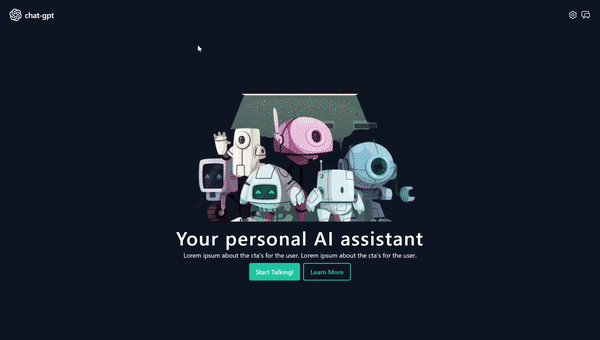

# Vite React Typescript Tailwind Template

<p align="center">
    
    <br>
    <br>
</p>

This is a chat-app that was built using [Open AI's API](https://platform.openai.com/docs/introduction). You can:

1. Chat with Open AI's models
2. Summarize and store your conversations
3. Configure the session's settings, i.e. the model's parameter such as the *Temperature*, *Max Token Length*, and *System Prompt*

## Impoving the Design

For this project, I thought about how I could further improve the design of [Chat GPT](https://chat.openai.com/) to enhance the user's experience. Here are some of the design decisions I took and the reasoning behind them:

1. **Clear Call-to-Actions (CTAs)** so that the user knows what to do immediately → I felt that Chat GPT's homepage is cluttered. There's info about the models, prompt templates, a textarea for the chats, and a side-drawer with the previous conversations. I decided to strip away all of this information so that the user understands what the app's core feature is. Then, once they feel ready to check the other features out, they can click on the icons.
2. **Prompt templates on the chat page**  → They're displayed before the conversation has been initiated, before the user has typed anything. So, in case, the user has run out of ideas, they can fall back on the templates.
3. **A separate about page** → The product's capabilities and limitations were placed together with the prompts, thus making it difficult to distinguish between them. So, I decided to assign them a separate page that the user could check out if they're interested to learn more.
4. I like the Open AI's chat page; it feels like you're having a conversation with an actual person. So, I decided to lean further in this direction by creating a **chat interface similar to Whatsapp**, with speech bubbles, and typing animations.
5. **Dark theme for accessibility** → So that it doesn't strain the users' eyes.
6. **The frontend's responsive** and works on mobile too


## Technologies


- [React](https://reactjs.org/)
- [TypeScript](https://www.typescriptlang.org/)
- [TailwindCSS](https://tailwindcss.com/) for utility CSS classes
- [ESLint](https://eslint.org/) configured with some initial rules
- [Prettier](https://prettier.io/) to enforce consistent code style
- [Vitest](https://vitest.dev/) for unit testing and code coverage
- [Vite](https://vitejs.dev/) to build the project for development or production
- [Husky 🐶](https://typicode.github.io/husky/) runs the full list of specs before committing your changes to ensure that you have a green build

## Development

### Setup

1. `git clone https://github.com/nrabhiram/chat-gpt-ui.git`
2. Run `npm install` to install all of the project's dependencies
3. Build the project for production: `npm run build`
4. Run the local development server: `npm run dev`
5. Create a `.env` file in the project root folder and add your API key:
   
    ```
    VITE_OPENAI_API_KEY = <YourApiKey>
    ```

### Tailwind + CSS Modules

1. Create a CSS Module file by following the naming convention - `<Component>.module.css`
2. Use the `@apply` directive in your CSS class definitions to use Tailwind's utility classes into your own custom CSS
    
    ```css
    .app-heading {
        @apply text-5xl font-semibold mb-4;
    }
    ```
3. Import the CSS Module file into the React component file

### Dev Loop

- `prettier-format` - run the autoformatter
- `lint` - run the linter
- `test` - run the specs
- `test-filter <spec-name>` - run a specific spec
- `coverage` - get a coverage report of the specs
- `build` - build the project files for distribution
- `dev` - run the local development server

## Contributing

Feel free to [open an issue](https://github.com/nrabhiram/vite-react-ts-tailwind-template/issues/new) or create a PR if you'd like to contribute 🙌

## License

The project is available as open source under the terms of the [MIT License](LICENSE).
